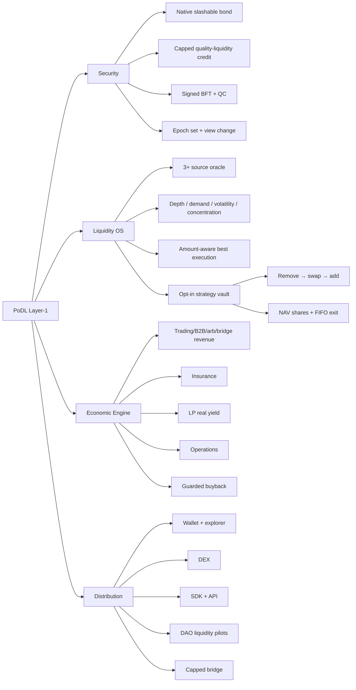

# PoDL Investor-at-a-Glance Model

## One-line model

PoDL turns independently verified liquidity quality into bounded network-security credit, safer trade routing and opt-in physical vault allocation—then distributes only realized revenue through an insurance-first waterfall.

## Functional tree

## 3D diagram generation prompt

> Create a premium isometric 3D functional ecosystem map for “PoDL — Proof of Dynamic Liquidity”, designed for institutional investors to understand in 10 seconds. Dark navy background, glassmorphism layers, cyan/teal liquidity streams, gold realized-revenue streams, red risk-control shields, clean white labels, 16:9, ultra-sharp, no decorative clutter. Center: a glowing PoDL Layer-1 settlement core with “Signed BFT Finality”, “Deterministic State”, and “Native Bond + Capped Liquidity Credit”. Left input layer: Users, Traders, LP Providers, Validators, Token Projects/DAOs, Developers, External Chains. Top intelligence layer: Multi-source Oracle, TWAP/Price History, Executable Depth, Organic Demand, Volatility, LP Concentration; merge them into a “Liquidity Quality Score + Circuit Breaker”. Middle market layer: Native DEX Pools A/B/C and an “Amount-Aware Best Execution Router” comparing direct and two-hop routes using output, slippage, depth, gas and quality. Lower capital layer: an opt-in “Strategy Vault” with numbered arrows “1 LP Deposit → 2 NAV Shares → 3 Remove Liquidity → 4 Asset Swap → 5 Add to Target Pool → 6 FIFO Proportional Exit”; visually distinguish routing signals from actual physical capital movement. Right economic layer: Trading Fees, B2B Liquidity-as-a-Service, Protocol Arbitrage and Bridge Fees entering a “Realized Revenue Only” box, then splitting to 45% LP Real Yield, 25% Insurance, 20% Operations, 10% Guarded Buyback; show emissions outside this revenue box with label “Bootstrap, not revenue”. Bottom control layer: Snapshot Governance → Timelock → Typed Execution; Limited Guardian Pause; Threshold Bridge Attestations + Per-Tx/Daily Caps + Replay Protection. Far-right outcome cards: “Lower bad execution”, “Managed proportional liquidity”, “Measurable security”, “Transparent revenue”, “Developer platform”. Add a red badge: “Current stage: Restricted Testnet — Not Mainnet Ready”. Add a caption: “Differentiation = integrated closed loop, not a claim that each primitive is globally first.” Do not claim guaranteed APY, guaranteed principal, audited, patented, globally unique, or production ready.

## Investor takeaway

- Native slashable security remains mandatory; volatile LP cannot fully control consensus.
- Routing signals do not move ordinary user LP.
- Physical movement is opt-in, vault-custodied and proportionally owned.
- Yield is variable and usage-based; emissions are separate.
- Automation has caps, circuit breakers, timelocks, queues or pause boundaries.
- This is a broad testnet engineering foundation, not yet audited/adopted mainnet infrastructure.
