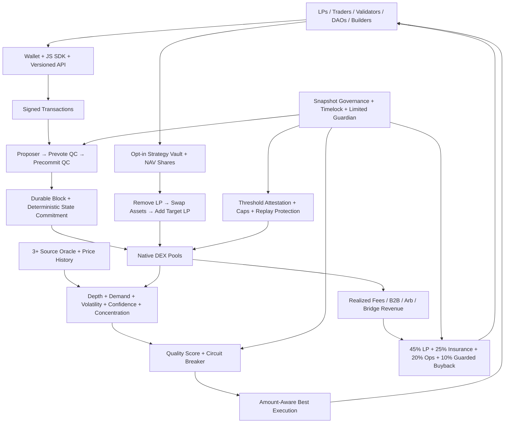
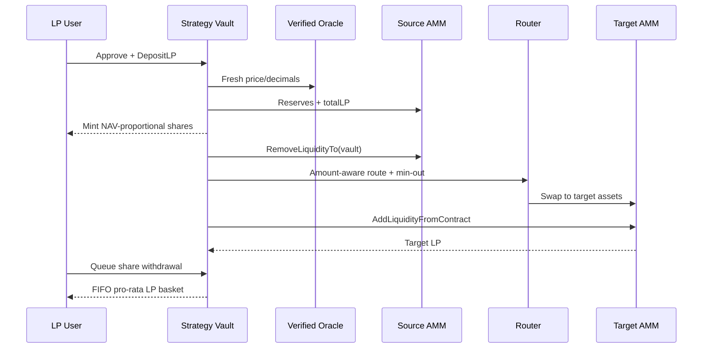

# PoDL v2 — 1–11 Implementation & Readiness Report

Date: 2026-08-11

> 2026-08-12 closure addendum: the percentages below are the pre-hardening baseline and are retained only as history. The authoritative current result is [INTERNAL_ENGINEERING_CLOSURE.md](./INTERNAL_ENGINEERING_CLOSURE.md), the feature matrix is [TABLE1_COMPLETION_MATRIX.md](./TABLE1_COMPLETION_MATRIX.md), and consensus execution is [STATE_TRANSITION_SPEC.md](./STATE_TRANSITION_SPEC.md). The full internal release gate passes. Mainnet is still not recommended because external evidence cannot be created by code.

Scope: repository engineering pass. This is not an audit, patentability opinion, adoption proof or mainnet certification.

## Executive verdict

PoDL is now best described as a **hybrid BFT Layer-1 with liquidity-quality-informed validator power, dynamic best-execution routing, and an LP strategy vault that can physically remove/swap/add liquidity across pools**.

Its strongest differentiation is the integrated loop:

`verified liquidity quality → bounded security credit → risk-aware routing → opt-in vault movement → realized revenue → LP/insurance waterfall`.

The 1–11 engineering implementation pass is complete, but production evidence is not. The next correct launch is a **restricted multi-validator testnet**, not mainnet.

## Implementation status

| # | Layer | What is implemented | Engineering depth | Still required for production |
|---:|---|---|---:|---|
| 1 | Protocol foundation | Versioned chain/genesis spec, spec hash, protocol/state version, deterministic sorted state commitment, block state root and strict P2P chain-spec match | 80% | Formal state-transition spec and independent-client replay equivalence |
| 2 | Consensus | Signed prevote/precommit, weighted QC, equivocation evidence, native bond + capped liquidity credit, epoch/joint set changes, weighted proposer, timeout/view change, signed-only mode | 68% | Byzantine/partition test on 4–20 independent nodes and formal review |
| 3 | Oracle/quality | Median of >=3 sources, staleness/outlier filters, depth, executable depth, organic demand, volatility, concentration, confidence and circuit breaker | 72% | Authenticated oracle transactions and live independent sources |
| 4 | Router | Actual-size direct/all-two-hop quote comparison using output, impact, depth, quality and deterministic gas tie-break | 82% | Route fuzzing, MEV controls and live slippage evidence |
| 5 | Vault | Real LP custody, oracle NAV shares, real remove/swap/add, slippage/deadline/cooldown, 15% default buffer and FIFO proportional LP exit | 73% | Audit, adversarial E2E and UI migration from legacy metadata API |
| 6 | Economics | Realized-revenue ledger, insurance/LP/operations/buyback waterfall, insurance-first buyback guard; emissions excluded from revenue | 68% | Calibrated token model, actual revenue and legal/accounting review |
| 7 | Governance | Power snapshot, voting, quorum, approval, timelock, typed execution rollback and limited guardian pause | 63% | Signed on-chain proposal transactions and public governance drills |
| 8 | API/ops | Versioned status, Prometheus metrics, expanded fail-closed readiness and readiness deadlock fix | 76% | SLO/paging, indexer failover and long soak |
| 9 | Bridge | Signed attestations, allowlisted threshold, finality, caps, replay consumption and relayer enforcement hook | 58% | Enforcement is off by default; independent signers/light client and audit |
| 10 | Product/SDK | Three disclosed risk tiers, protocol-capital-only B2B pilots, non-projecting investor metrics and dependency-free JS SDK | 64% | Customers, security UX, SDK stabilization and jurisdiction policy |
| 11 | Verification/docs | Full Go tests, race run, builtin compile, JS syntax, benchmarks, flows and operations docs | 62% | Fuzz/property/chaos tests and independent audit |

Percentages measure engineering depth, not commercial-success probability.

## Top-to-bottom architecture



## How each critical flow works

### Finality

Every node derives the same proposer from height, round and the epoch validator snapshot. Validators sign prevotes; >2/3 weighted power creates a lock/QC. Signed precommits create the final QC. The block is fsynced before the memory tip advances. A timeout rotates a stalled proposer but retains the safety lock. `LQD_REQUIRE_SIGNED_BFT=true` disables unsigned bootstrap finality.

Incoming blocks are now fully re-executed against an isolated account/contract overlay. Parent root, transaction/reward semantics and post-state root are compared before the overlay can be staged and committed. Independent-client equivalence and a mechanized proof remain external assurance work.

### Validator power

```text
native weight = sqrt(native LQD bond)
liquidity credit = min(quality-adjusted LP power, configured native-weight cap)
voting power = (native weight + bounded liquidity credit) × penalty factor
```

Liquidity augments slashable native security; it does not replace it. Low-depth, concentrated, volatile, stale-oracle or circuit-broken pools receive little/zero credit.

### Dynamic routing

Epoch evaluation uses the finalized block timestamp. Pool utilization and organic-flow signals are combined with oracle/TWAP quality. Circuit-broken pools fall to minimum routing weight. For each user amount, direct and all valid two-hop paths are quoted and compared. User min-out/deadline remains the final protection.

Routing does not seize ordinary LP assets. Physical movement occurs only inside the opt-in custody vault.

### Vault and withdrawal



Shares preserve proportional ownership after movement. The project must not promise original quantity or fiat principal: users receive a proportional claim on remaining assets and can realize impermanent loss.

### Real yield

Only realized trading fees, protocol-arbitrage profit, B2B liquidity fees, lending interest, bridge fees and slashing enter revenue accounting. Emissions are never called revenue.

Default allocation: 45% LP real yield, 25% insurance, 20% operations and 10% buyback. Buyback is disabled by default; until governance enables it and the insurance floor is met, that slice also goes to insurance.

### Governance

`proposal → fixed power snapshot → vote → quorum/approval → timelock → typed action`.

The guardian may only pause bridge/vault/router. It cannot move funds, execute arbitrary code or unpause.

### Bridge

`source event → signed independent observations → threshold → finality → per-tx/daily cap reservation → event consumption → mint/release`.

Default compatibility mode does not enforce threshold attestations. Mainnet readiness fails until enforcement, signer independence and caps are configured.

## Stakeholder impact

| Stakeholder | Benefits | Disadvantages / risks |
|---|---|---|
| Retail LP | One proportional managed position, clear risk tier, transparent queued exit | No principal guarantee; IL, oracle, contract and queue risk |
| Trader | Better amount-aware route, bad-pool circuit breaker | Two hops may cost more; markets can still be shallow |
| Validator | Quality liquidity can augment bonded power/reward | Double-sign evidence is slashable; volatile LP gets little credit |
| DAO/token project | Capped protocol-capital liquidity pilot and measurable quality | Governance/caps reduce speed; no promised volume |
| Developer | Full-stack chain/contracts/API/SDK | Custom Go-plugin VM is not yet a production-grade sandbox |
| Investor | Verifiable revenue/security/concentration data without invented forecasts | No audit, legal opinion, decentralization proof or revenue history yet |

## Verification evidence

| Check | Result |
|---|---|
| `go test ./...` | Pass for chain, server, aggregator and wallet packages |
| `go test -race ./...` | Pass in this workspace run |
| Builtin contract compilation | Pass, including DEX and strategy vault |
| `node --check sdk/javascript/src/index.js` | Pass |
| `go vet ./...` | Pass; persistence no longer copies mutex-bearing chain values |
| 4–20 process-validator integration | Pass: 20 test-liquidity claims, 351 independent signed votes, 17 precommit QCs |
| Explorer | 83/83 tests, Vite production build, npm audit 0 |
| Swap | 21/21 tests, Vite production build, npm audit 0 |
| Bridge Admin | Production build, npm audit 0 |
| State root, 10k accounts | Latest: 7.36 ms/op, 3.07 MB, 20,034 allocations on Apple M1 |
| Weighted proposer, 100 validators | Latest: 41.2 µs/op, 34.7 KB, 207 allocations on Apple M1 |
| Local load smoke | 3,000 requested; 100 accepted; ~31.64 accepted requests/s; one 100-tx block finalized |

The load result is not maximum TPS. It used one funded sender and one unsigned bootstrap validator; nonce/funding constraints rejected most requests. Publish TPS only after a sustained signed multi-validator benchmark with many funded senders and finalized-throughput measurement.

## Evidence-weighted readiness

| Target | Score | Decision |
|---|---:|---|
| Scoped internal Table-1 engineering | 100% | Complete |
| Local/restricted no-value testnet | 96% | Ready to run |
| Public incentivized testnet | 78% | Requires real independent operators/oracles |
| Public-capital mainnet | 48% | Do not launch |

Runtime `/readiness/mainnet` is fail-closed. It requires valid spec/state commitment, 4+ hybrid validators, observed signed QC, legacy finality disabled, bridge threshold, healthy verified pools, audit evidence, public soak and restore drill.

## Launch recommendation

Launch a restricted testnet next:

1. Four independently operated validators with unique signing keys and native bonds.
2. Enable signed-only BFT; prove unsigned votes cannot advance.
3. Keep bridge paused and public deposits disabled.
4. Run three independent oracle publishers and capped canonical pools.
5. Soak 30–60 days with partition, equivocation, restart, DB restore and withdrawal-burst drills.
6. Complete property/fuzz testing and two audits: consensus/VM; DEX/vault/bridge.
7. Complete legal entity, jurisdiction, token/yield disclosure and KYC-boundary work.
8. Then use protocol-owned capital for a capped mainnet canary before any user capital.

## Main blockers

- Formal BFT proof, independent clients and independently operated-machine evidence.
- Go-plugin VM sandbox/deterministic gas hardening.
- External vault/AMM/bridge audits and bug bounty.
- Distributed bridge security or light-client proofs.
- Physical-HSM vendor certification, mobile secure signing and phishing simulation review.
- Real customers, revenue/retention and jurisdiction-specific compliance.

## Main implementation locations

- `BlockchainComponent/protocol_spec.go`
- `BlockchainComponent/consensus_bft.go`
- `BlockchainComponent/liquidity_quality.go`
- `BlockchainComponent/dynamic_liquidity.go`
- `contract/dex_factory.go`
- `contract/strategy_vault.go`
- `BlockchainComponent/economic_policy.go`
- `BlockchainComponent/governance.go`
- `BlockchainComponent/bridge_security.go`
- `BlockchainComponent/product_model.go`
- `BlockchainServer/blockchain_server.go`
- `sdk/javascript/`
